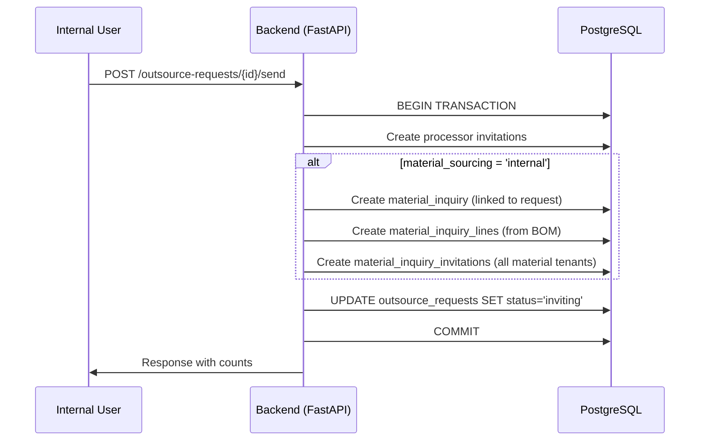
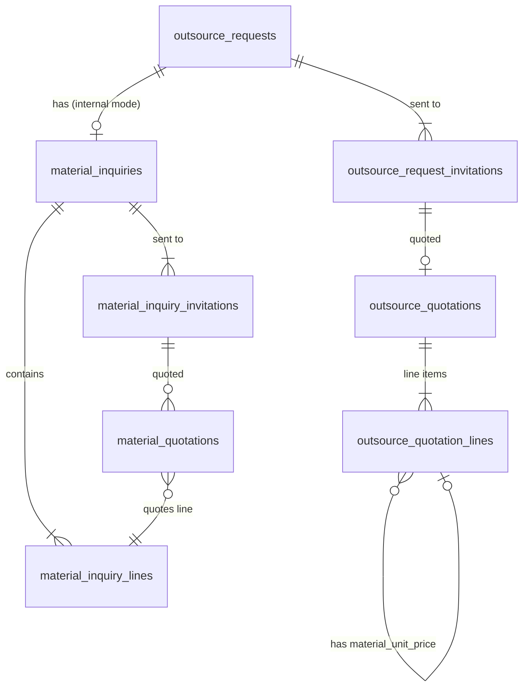

# Design Document: Material Sourcing at Inquiry Stage

## Overview

This feature moves the material sourcing decision (internal supply vs processor self-sourcing) from the outsource order stage to the outsource request stage. When an internal user clicks "broadcast," the system simultaneously sends processor invitations and—when mode is 'internal'—auto-creates a multi-line material inquiry and broadcasts it to material suppliers. Processors in 'processor' mode must include material cost per scope item in their quotes.

**Key design decisions:**
1. Single-click broadcast triggers both processor and material sourcing tracks atomically
2. Material inquiry lines are auto-derived from `project_parts.material` (distinct material_code + spec)
3. `material_inquiries.outsource_order_id` becomes nullable; a new `outsource_request_id` FK links inquiries pre-award
4. Processor quote lines gain `material_unit_price` for cost transparency in self-sourcing mode

## Architecture





## Components and Interfaces

### Database Migration (012_material_sourcing_at_inquiry.sql)

**Changes to existing tables:**

1. `outsource_requests` — add `material_sourcing VARCHAR(16)` nullable
2. `material_inquiries` — add `outsource_request_id INTEGER` FK, make `outsource_order_id` nullable
3. `outsource_quotation_lines` — add `material_unit_price DECIMAL(14,2)` nullable
4. `material_quotations` — add `inquiry_line_id INTEGER` FK nullable

**New table:**

5. `material_inquiry_lines` — multi-line BOM for a material inquiry

### Backend API Changes

#### Modified: `POST /api/internal/outsource-requests/{req_id}/send` (internal.py)

Current behavior: Creates processor invitations only.

New behavior:
- Validates `material_sourcing` is not NULL (reject with 400 if missing)
- Creates processor invitations (unchanged)
- If `material_sourcing = 'internal'`:
  - Creates one `material_inquiries` record with `outsource_request_id` set
  - Extracts distinct `(material, spec)` from `project_parts` → creates `material_inquiry_lines`
  - Creates `material_inquiry_invitations` for all material-type tenants
- All within a single transaction
- Returns enriched response with `invited_processor_count`, `material_inquiry_id`, `material_inquiry_no`, `invited_material_supplier_count`

#### Modified: `GET /api/processor/invitations/{inv_id}` (processor.py)

Add `material_sourcing` field to response by joining through `outsource_requests`.

#### Modified: `POST /api/processor/invitations/{inv_id}/quote` (processor.py)

- Accept `material_unit_price` in `QuoteLine` model
- If parent request has `material_sourcing = 'processor'`: require `material_unit_price > 0` per line
- If parent request has `material_sourcing = 'internal'`: ignore/nullify `material_unit_price`
- Store in `outsource_quotation_lines.material_unit_price`

#### Modified: `POST /api/material/inquiries/{inv_id}/quote` (inquiry.py)

- Support per-line quoting: accept `lines: [{inquiry_line_id, unit_price, lead_time_days, note}]`
- Validate each `inquiry_line_id` belongs to the inquiry
- Upsert: if a quotation for the same (invitation_id, inquiry_line_id) exists, update it
- Aggregate total price across lines for the summary quotation

#### Modified: Award flow (internal.py — outsource order creation)

When creating an `outsource_order` from an awarded request:
- Copy `material_sourcing` from `outsource_requests` to `outsource_orders`
- Find all `material_inquiries` where `outsource_request_id = request_id`
- Update their `outsource_order_id` to the new order

### Frontend Changes

#### `outsource-request-detail.html`

- Add radio button group for material sourcing mode (visible in draft status)
- Save selection via `PATCH /api/internal/outsource-requests/{id}` (existing endpoint or new field)
- Show read-only badge when status ≠ draft
- Validate selection before broadcast; show error "请先选择材料供应方式" if NULL
- After broadcast success: show material inquiry info in toast if mode = internal

#### `invitation-detail.html` (processor)

- Display material sourcing notice banner:
  - `internal`: "📦 材料由我方统一供应，无需报材料费"
  - `processor`: "🛒 材料由贵方自行采购，请在报价中包含材料成本"
- In line-by-line quote mode with `processor` sourcing: add `material_unit_price` input column
- Validate `material_unit_price > 0` before submit when mode = processor

#### Material supplier quote page (existing `material-inquiry-detail.html` or new)

- Show multi-line inquiry lines in a table
- Allow per-line unit_price + lead_time_days input
- Submit as array of line quotations

## Data Models

### New Table: `material_inquiry_lines`

```sql
CREATE TABLE IF NOT EXISTS material_inquiry_lines (
    id              SERIAL PRIMARY KEY,
    inquiry_id      INTEGER NOT NULL REFERENCES material_inquiries(id) ON DELETE CASCADE,
    material_code   VARCHAR(64) NOT NULL,
    material_name   VARCHAR(128),
    spec            VARCHAR(128),
    qty             DECIMAL(14,2) NOT NULL,
    unit            VARCHAR(16) DEFAULT 'kg',
    sort_order      INTEGER NOT NULL DEFAULT 0,
    created_at      TIMESTAMP DEFAULT CURRENT_TIMESTAMP
);
CREATE INDEX IF NOT EXISTS idx_mil_inquiry ON material_inquiry_lines (inquiry_id);
```

### Altered: `outsource_requests`

```sql
ALTER TABLE outsource_requests
    ADD COLUMN IF NOT EXISTS material_sourcing VARCHAR(16);
-- NULL = not yet decided; 'internal' or 'processor'
```

### Altered: `material_inquiries`

```sql
ALTER TABLE material_inquiries
    ADD COLUMN IF NOT EXISTS outsource_request_id INTEGER REFERENCES outsource_requests(id),
    ALTER COLUMN outsource_order_id DROP NOT NULL;
CREATE INDEX IF NOT EXISTS idx_mi_request ON material_inquiries (outsource_request_id);
```

### Altered: `outsource_quotation_lines`

```sql
ALTER TABLE outsource_quotation_lines
    ADD COLUMN IF NOT EXISTS material_unit_price DECIMAL(14,2);
```

### Altered: `material_quotations`

```sql
ALTER TABLE material_quotations
    ADD COLUMN IF NOT EXISTS inquiry_line_id INTEGER REFERENCES material_inquiry_lines(id);
-- Drop the existing UNIQUE on invitation_id (one quote per invitation)
-- Replace with UNIQUE (invitation_id, inquiry_line_id) for per-line quoting
ALTER TABLE material_quotations DROP CONSTRAINT IF EXISTS material_quotations_invitation_id_key;
ALTER TABLE material_quotations
    ADD CONSTRAINT uk_mq_inv_line UNIQUE (invitation_id, inquiry_line_id);
```

### Pydantic Models (new/modified)

```python
# In processor.py QuoteLine
class QuoteLine(BaseModel):
    scope_item_id: int
    unit_price: float = Field(..., gt=0)
    lead_time_days: int = Field(..., ge=1)
    material_unit_price: Optional[float] = None  # NEW
    note: Optional[str] = None

# In inquiry.py — new model for per-line material quoting
class MaterialQuoteLine(BaseModel):
    inquiry_line_id: int
    unit_price: float = Field(..., gt=0)
    lead_time_days: int = Field(..., ge=1)
    note: Optional[str] = None

class MaterialQuoteSubmitMultiLine(BaseModel):
    lines: list[MaterialQuoteLine]
    note: Optional[str] = None
```

## Correctness Properties

*A property is a characteristic or behavior that should hold true across all valid executions of a system—essentially, a formal statement about what the system should do. Properties serve as the bridge between human-readable specifications and machine-verifiable correctness guarantees.*

### Property 1: Broadcast in internal mode creates inquiry with correct BOM-derived lines

*For any* outsource request with `material_sourcing='internal'` and any set of project parts, broadcasting SHALL create exactly one material inquiry whose lines match the distinct `(material, spec)` combinations from the project's parts list, with quantities summed per combination.

**Validates: Requirements 2.4, 4.1, 4.2**

### Property 2: Broadcast in processor mode creates no material inquiry

*For any* outsource request with `material_sourcing='processor'`, broadcasting SHALL create processor invitations but SHALL NOT create any material inquiry or material inquiry lines.

**Validates: Requirements 4.5**

### Property 3: Broadcast in internal mode invites all material tenants

*For any* outsource request with `material_sourcing='internal'` and any set of material-type tenants with linked suppliers, broadcasting SHALL create exactly one material_inquiry_invitation per material tenant.

**Validates: Requirements 4.3**

### Property 4: Invitation detail API includes material_sourcing from parent request

*For any* processor invitation, the detail API response SHALL include a `material_sourcing` field whose value equals the `material_sourcing` column of the associated outsource_request.

**Validates: Requirements 5.1, 5.2**

### Property 5: Processor quote in processor mode requires valid material_unit_price

*For any* quote submission in line-by-line mode where the parent request has `material_sourcing='processor'`, the system SHALL reject the submission if any line has `material_unit_price` ≤ 0 or NULL.

**Validates: Requirements 6.2, 6.3**

### Property 6: Processor quote in internal mode nullifies material_unit_price

*For any* quote submission where the parent request has `material_sourcing='internal'`, regardless of submitted `material_unit_price` values, the stored `outsource_quotation_lines.material_unit_price` SHALL be NULL.

**Validates: Requirements 6.4**

### Property 7: Material supplier per-line quoting with validation

*For any* multi-line material inquiry and any material supplier quote submission, the system SHALL accept quotations only for `inquiry_line_id` values that belong to the inquiry associated with the supplier's invitation, and SHALL reject any submission referencing an invalid line.

**Validates: Requirements 7.2, 7.3**

### Property 8: Material quotation upsert idempotence

*For any* material supplier and any inquiry line, submitting a quotation twice SHALL result in exactly one quotation record for that (invitation_id, inquiry_line_id) pair, with the values from the latest submission.

**Validates: Requirements 7.5**

### Property 9: Material quotation line aggregation

*For any* set of per-line quotations from a single material supplier for a single inquiry, the aggregated total price SHALL equal the sum of `(unit_price × qty)` across all quoted lines.

**Validates: Requirements 7.4**

### Property 10: Award links material inquiries to new order

*For any* outsource request that has one or more material inquiries, when an outsource order is created from that request, all associated material inquiries SHALL have their `outsource_order_id` updated to the new order's id.

**Validates: Requirements 3.4, 8.1, 8.2**

### Property 11: Award propagates material_sourcing to order

*For any* outsource request with a non-null `material_sourcing` value, when an outsource order is created, the order's `material_sourcing` column SHALL equal the request's `material_sourcing` value.

**Validates: Requirements 8.3**

### Property 12: Broadcast response contains correct counts

*For any* successful broadcast with `material_sourcing='internal'`, the response SHALL contain `invited_processor_count` equal to the number of processor invitations created, `material_inquiry_id` matching the created inquiry's id, and `invited_material_supplier_count` equal to the number of material invitations created.

**Validates: Requirements 10.1**

## Error Handling

| Scenario | HTTP Status | Error Message |
|----------|-------------|---------------|
| Broadcast with `material_sourcing` = NULL | 400 | "请先选择材料供应方式" |
| Broadcast when no project parts have material | 400 | "项目零件清单中没有材料信息，无法创建材料询价" |
| Broadcast when no material tenants exist | 400 | "没有可邀请的材料方" (existing) |
| Processor quote missing `material_unit_price` in processor mode | 400 | "加工方自采模式下必须填写每行材料单价" |
| Material quote with invalid `inquiry_line_id` | 400 | "报价行引用的询价行不属于该询价单" |
| Material quote for non-inviting inquiry | 409 | "询价单状态不再接受报价" (existing) |
| Transaction failure during broadcast | 500 | Automatic rollback; no partial state |

## Testing Strategy

### Property-Based Tests (pytest + hypothesis)

Each correctness property maps to one property-based test with minimum 100 iterations. Tests will use an in-memory or test PostgreSQL database with fixtures.

- **Library**: `hypothesis` with `hypothesis[database]`
- **Configuration**: `@settings(max_examples=100)`
- **Tag format**: `# Feature: material-sourcing-at-inquiry, Property N: <title>`

Key generators:
- `st_project_parts()`: generates random lists of project parts with varying material/spec combinations
- `st_material_tenants()`: generates random sets of material-type tenants with supplier links
- `st_quote_lines()`: generates random quote line submissions with valid/invalid material_unit_price values
- `st_inquiry_lines()`: generates random material inquiry line sets

### Unit Tests (pytest)

- Broadcast with NULL material_sourcing → 400
- Broadcast with empty BOM (no materials) → 400
- Processor quote in internal mode ignores material_unit_price
- Material supplier quote for single-line inquiry (backward compat)
- Award with no pre-existing material inquiry → success
- Frontend radio button visibility based on status (if testing with playwright/selenium)

### Integration Tests

- Full broadcast → material supplier quote → close → award → order creation flow
- Transaction rollback on simulated failure
- Concurrent broadcast attempts (idempotency)
