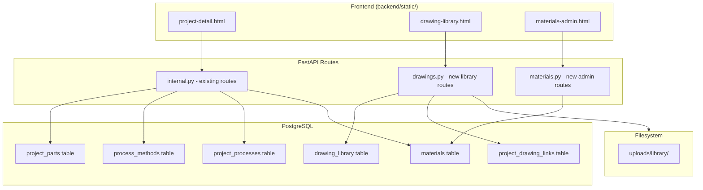
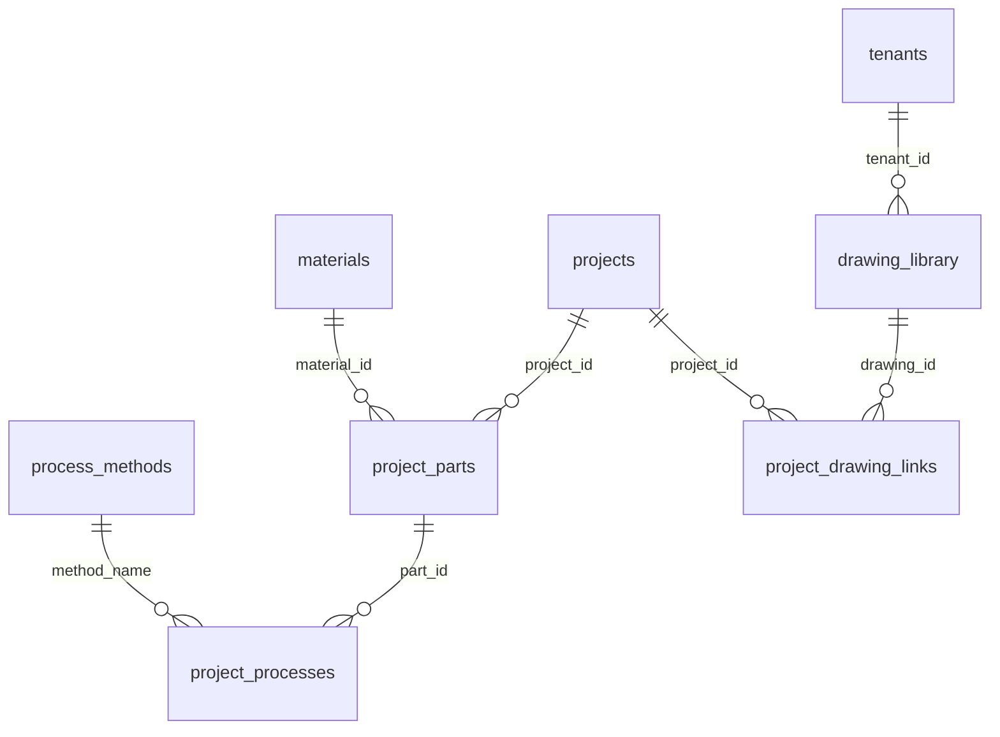

# Design Document: Part Selection and Drawing Library

## Overview

This feature enhances the mold outsourcing procurement system with three interconnected capabilities:

1. **Materials Dictionary** — A managed lookup table replacing free-text material input with standardized selection
2. **Process Method Multi-Select** — Structured process selection from the existing `process_methods` table when adding parts
3. **Drawing Library** — A tenant-scoped centralized drawing repository with project linking (reference-based, not copy)

The design prioritizes backward compatibility (existing `material` text column preserved, legacy `processes` field still accepted) and follows the existing patterns in `backend/mvp/routes/internal.py` and `backend/mvp/db.py`.

## Architecture



**Key architectural decisions:**
- New routes in separate files (`materials.py`, `drawings.py`) to keep `internal.py` manageable, mounted under the same `/api/internal` prefix
- Drawing files stored in `backend/uploads/library/` (separate from per-project `uploads/drawings/`)
- Tenant scoping enforced at the query level (WHERE tenant_id = user.tenant_id)
- Denormalized `material` text column preserved for display performance and backward compatibility

## Components and Interfaces

### API Endpoints

#### Materials Admin (new file: `backend/mvp/routes/materials.py`)

| Method | Path | Description |
|--------|------|-------------|
| GET | `/api/internal/materials` | List active materials (for dropdown) |
| GET | `/api/internal/admin/materials` | List all materials (admin view, includes inactive) |
| POST | `/api/internal/admin/materials` | Create material |
| PATCH | `/api/internal/admin/materials/{id}` | Update material |
| DELETE | `/api/internal/admin/materials/{id}` | Delete material (if unreferenced) |

#### Drawing Library (new file: `backend/mvp/routes/drawings.py`)

| Method | Path | Description |
|--------|------|-------------|
| GET | `/api/internal/drawing-library` | List tenant drawings (with filter/search) |
| POST | `/api/internal/drawing-library` | Upload new drawing |
| GET | `/api/internal/drawing-library/{id}` | Get drawing detail |
| PATCH | `/api/internal/drawing-library/{id}` | Update drawing metadata |
| DELETE | `/api/internal/drawing-library/{id}` | Delete drawing (if unlinked) |
| GET | `/api/internal/drawing-library/{id}/download` | Download file |

#### Project Drawing Links (in `backend/mvp/routes/drawings.py`)

| Method | Path | Description |
|--------|------|-------------|
| GET | `/api/internal/projects/{project_id}/drawing-links` | List linked drawings |
| POST | `/api/internal/projects/{project_id}/drawing-links` | Link drawings to project |
| DELETE | `/api/internal/projects/{project_id}/drawing-links/{link_id}` | Unlink drawing |

#### Modified Existing Endpoints

| Method | Path | Change |
|--------|------|--------|
| POST | `/api/internal/projects/{project_id}/parts` | Accept `material_id` and `process_method_ids` |
| GET | `/api/internal/projects/{project_id}` | Include `drawing_links` in response |

### Pydantic Models

```python
# materials.py
class MaterialCreate(BaseModel):
    code: str = Field(..., min_length=1, max_length=64)
    name: str = Field(..., min_length=1, max_length=128)
    category: Optional[str] = Field(None, max_length=64)
    remark: Optional[str] = None
    is_active: bool = True

class MaterialUpdate(BaseModel):
    code: Optional[str] = Field(None, max_length=64)
    name: Optional[str] = Field(None, max_length=128)
    category: Optional[str] = Field(None, max_length=64)
    remark: Optional[str] = None
    is_active: Optional[bool] = None

# drawings.py
class DrawingUpdate(BaseModel):
    name: Optional[str] = Field(None, max_length=255)
    description: Optional[str] = None
    category: Optional[str] = Field(None, max_length=64)
    tags: Optional[list[str]] = None

class DrawingLinkCreate(BaseModel):
    drawing_ids: list[int] = Field(..., min_length=1)

# Modified PartCreate in internal.py
class PartCreate(BaseModel):
    part_no: Optional[str] = None
    part_name: Optional[str] = None
    material: Optional[str] = None
    material_id: Optional[int] = None          # NEW: FK to materials table
    qty: int = Field(default=1, ge=1)
    processes: list[str] = Field(default_factory=list)
    process_method_ids: Optional[list[int]] = None  # NEW: FK list to process_methods
    spec: Optional[str] = None
    mold_id: Optional[int] = None
    part_type: Optional[str] = None
    sort_no: Optional[int] = None
```

### Frontend Pages

1. **Modified `project-detail.html`**:
   - Material input → `<select>` dropdown populated from GET `/api/internal/materials`
   - Process input → multi-select checkboxes/tags from GET `/api/internal/process-methods`
   - New "图纸库关联" section showing linked drawings with add/remove buttons
   - Drawing link modal with search/filter from drawing library

2. **New `drawing-library.html`**:
   - Table listing all tenant drawings with category filter and name search
   - Upload modal (file + name + description + category + tags)
   - Edit/delete actions per row

3. **New `materials-admin.html`**:
   - Table listing all materials with CRUD actions
   - Add/edit modal

## Data Models

### New Table: `materials`

```sql
CREATE TABLE IF NOT EXISTS materials (
    id          SERIAL PRIMARY KEY,
    code        VARCHAR(64) NOT NULL UNIQUE,
    name        VARCHAR(128) NOT NULL,
    category    VARCHAR(64),
    remark      TEXT,
    is_active   BOOLEAN NOT NULL DEFAULT TRUE,
    created_at  TIMESTAMP NOT NULL DEFAULT CURRENT_TIMESTAMP
);

CREATE INDEX IF NOT EXISTS idx_materials_category ON materials (category);
CREATE INDEX IF NOT EXISTS idx_materials_active ON materials (is_active);
```

### Modified Table: `project_parts`

```sql
ALTER TABLE project_parts
    ADD COLUMN IF NOT EXISTS material_id INTEGER REFERENCES materials(id);

CREATE INDEX IF NOT EXISTS idx_pp_material ON project_parts (material_id);
```

### New Table: `drawing_library`

```sql
CREATE TABLE IF NOT EXISTS drawing_library (
    id          SERIAL PRIMARY KEY,
    tenant_id   INTEGER NOT NULL REFERENCES tenants(id),
    name        VARCHAR(255) NOT NULL,
    description TEXT,
    file_name   VARCHAR(255) NOT NULL,
    file_path   VARCHAR(512) NOT NULL,
    file_size   BIGINT NOT NULL,
    mime_type   VARCHAR(128) NOT NULL,
    category    VARCHAR(64),
    tags        TEXT[] DEFAULT '{}',
    uploaded_by INTEGER REFERENCES users(id),
    created_at  TIMESTAMP NOT NULL DEFAULT CURRENT_TIMESTAMP,
    updated_at  TIMESTAMP NOT NULL DEFAULT CURRENT_TIMESTAMP
);

CREATE INDEX IF NOT EXISTS idx_dl_tenant ON drawing_library (tenant_id);
CREATE INDEX IF NOT EXISTS idx_dl_category ON drawing_library (tenant_id, category);
```

### New Table: `project_drawing_links`

```sql
CREATE TABLE IF NOT EXISTS project_drawing_links (
    id          SERIAL PRIMARY KEY,
    project_id  INTEGER NOT NULL REFERENCES projects(id) ON DELETE CASCADE,
    drawing_id  INTEGER NOT NULL REFERENCES drawing_library(id) ON DELETE RESTRICT,
    linked_by   INTEGER REFERENCES users(id),
    linked_at   TIMESTAMP NOT NULL DEFAULT CURRENT_TIMESTAMP,
    UNIQUE (project_id, drawing_id)
);

CREATE INDEX IF NOT EXISTS idx_pdl_project ON project_drawing_links (project_id);
CREATE INDEX IF NOT EXISTS idx_pdl_drawing ON project_drawing_links (drawing_id);
```

### Seed Data

```sql
INSERT INTO materials (code, name, category) VALUES
    ('Cr12MoV', 'Cr12MoV 冷作模具钢', 'cold_work'),
    ('SKD11',   'SKD11 冷作模具钢',   'cold_work'),
    ('DC53',    'DC53 冷作模具钢',     'cold_work'),
    ('SKD61',   'SKD61 热作模具钢',   'hot_work'),
    ('H13',     'H13 热作模具钢',     'hot_work'),
    ('S136',    'S136 防腐镜面钢',    'plastic_mold'),
    ('NAK80',   'NAK80 预硬塑胶钢',   'plastic_mold'),
    ('718H',    '718H 预硬塑胶钢',    'plastic_mold'),
    ('P20',     'P20 预硬塑胶钢',     'plastic_mold'),
    ('45#',     '45# 碳素结构钢',     'structural')
ON CONFLICT (code) DO NOTHING;
```

### Entity Relationship



## Correctness Properties

*A property is a characteristic or behavior that should hold true across all valid executions of a system — essentially, a formal statement about what the system should do. Properties serve as the bridge between human-readable specifications and machine-verifiable correctness guarantees.*

### Property 1: Materials list ordering

*For any* set of active materials in the database, the GET `/api/internal/materials` endpoint SHALL return them sorted by (category ASC, code ASC), and the result set SHALL contain only materials where is_active = TRUE.

**Validates: Requirements 2.1**

### Property 2: Material ID validation and denormalization

*For any* material_id value provided during part creation: if the material_id exists in the materials table, the part SHALL be created with `material_id` stored as a foreign key AND the `material` text column SHALL be automatically populated with the material's code; if the material_id does NOT exist, the request SHALL be rejected with HTTP 400.

**Validates: Requirements 2.2, 2.3, 2.4, 2.5**

### Property 3: Process method IDs validation and record creation

*For any* array of process_method_ids provided during part creation: if ALL ids exist in the process_methods table, the system SHALL create exactly len(process_method_ids) records in project_processes with sequential seq_no starting from 1; if ANY id does not exist, the request SHALL be rejected with HTTP 400 and the response SHALL list exactly the invalid ids.

**Validates: Requirements 3.2, 3.3, 3.4**

### Property 4: Process method IDs precedence

*For any* part creation request containing both `process_method_ids` and `processes` fields, the system SHALL use only `process_method_ids` to create project_processes records and SHALL ignore the `processes` field entirely.

**Validates: Requirements 3.6**

### Property 5: Drawing library tenant isolation

*For any* GET request to the drawing library by a user belonging to tenant T, ALL returned drawing records SHALL have tenant_id = T, and NO drawing belonging to a different tenant SHALL appear in the results.

**Validates: Requirements 4.3, 4.8**

### Property 6: Drawing link validation

*For any* set of drawing_ids in a link creation request: if ALL drawing_ids exist in drawing_library AND belong to the requesting user's tenant, link records SHALL be created for each; if ANY drawing_id does not exist or belongs to a different tenant, the entire request SHALL be rejected with HTTP 400.

**Validates: Requirements 5.2, 5.3**

### Property 7: Link deletion preserves drawing

*For any* project_drawing_link that is deleted, the corresponding drawing_library record SHALL continue to exist unchanged in the database.

**Validates: Requirements 5.5**

### Property 8: Drawing multi-project linking

*For any* single drawing_library record, it SHALL be possible to create project_drawing_links to N distinct projects simultaneously, and querying any of those projects SHALL return the drawing in its linked drawings list.

**Validates: Requirements 5.6**

### Property 9: Non-drafted project rejects link modifications

*For any* project whose status is NOT "drafted", attempts to POST or DELETE on the project's drawing-links endpoint SHALL be rejected with HTTP 409.

**Validates: Requirements 5.7, 5.8**

## Error Handling

| Scenario | HTTP Code | Response |
|----------|-----------|----------|
| material_id not found in materials table | 400 | `{"detail": "material_id 不存在: {id}"}` |
| process_method_id(s) not found | 400 | `{"detail": "无效的工序ID: [1, 5, 9]"}` |
| Delete material referenced by parts | 409 | `{"detail": "该材质已被 N 个零件引用，无法删除"}` |
| Delete drawing linked to projects | 409 | `{"detail": "该图纸已关联到项目: [P001, P002]，无法删除"}` |
| drawing_id not found or wrong tenant | 400 | `{"detail": "无效的图纸ID: [3, 7]"}` |
| Link/unlink on non-drafted project | 409 | `{"detail": "只有 drafted 状态的项目可以修改图纸关联"}` |
| Drawing not found (GET by id) | 404 | `{"detail": "Drawing not found"}` |
| Material not found (PATCH/DELETE) | 404 | `{"detail": "Material not found"}` |
| File upload too large (>50MB) | 413 | `{"detail": "文件大小超过限制 (50MB)"}` |
| Duplicate material code | 409 | `{"detail": "材质编码已存在: {code}"}` |
| Duplicate drawing link | 409 | `{"detail": "图纸已关联到该项目"}` |

## Testing Strategy

### Property-Based Tests (pytest + Hypothesis)

Property-based testing is appropriate for this feature because the validation logic (material ID lookup, process method ID validation, tenant scoping, status-based access control) involves pure logic that varies meaningfully with input and benefits from exhaustive input generation.

**Library:** `hypothesis` (Python)
**Minimum iterations:** 100 per property

Each property test will be tagged with:
```python
# Feature: part-selection-and-drawing-library, Property {N}: {title}
```

Properties to implement:
1. Materials list ordering — generate random materials, verify sort order
2. Material ID validation — generate valid/invalid IDs, verify behavior
3. Process method IDs validation — generate valid/invalid ID sets, verify behavior
4. Process method IDs precedence — generate both fields, verify only IDs used
5. Drawing library tenant isolation — generate multi-tenant data, verify isolation
6. Drawing link validation — generate valid/invalid/cross-tenant IDs, verify behavior
7. Link deletion preserves drawing — delete links, verify drawings persist
8. Drawing multi-project linking — link one drawing to N projects, verify all visible
9. Non-drafted project rejects link modifications — generate non-drafted statuses, verify 409

### Unit Tests (pytest)

- Material CRUD happy path (create, read, update, delete)
- Drawing upload with valid file
- Drawing metadata update
- Part creation with material_id (specific example)
- Part creation with process_method_ids (specific example)
- Project detail includes drawing_links array
- Distinction between attachments and drawing_links in response

### Integration Tests

- File upload → filesystem storage → download serves correct file with Content-Type
- Seed data present after migration
- Drawing delete removes file from filesystem

### Edge Cases

- Delete material that IS referenced → 409
- Delete drawing that IS linked → 409
- Empty process_method_ids array → treated as no processes
- material_id=null with material text → backward compatible behavior
- Upload file with non-ASCII filename
- Concurrent link creation (UNIQUE constraint handles duplicates)
