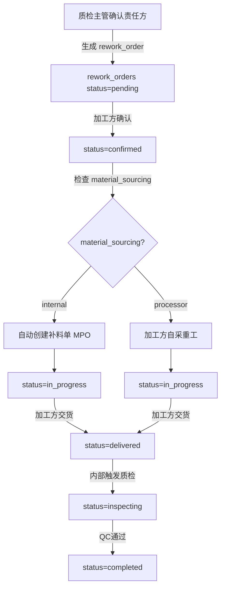
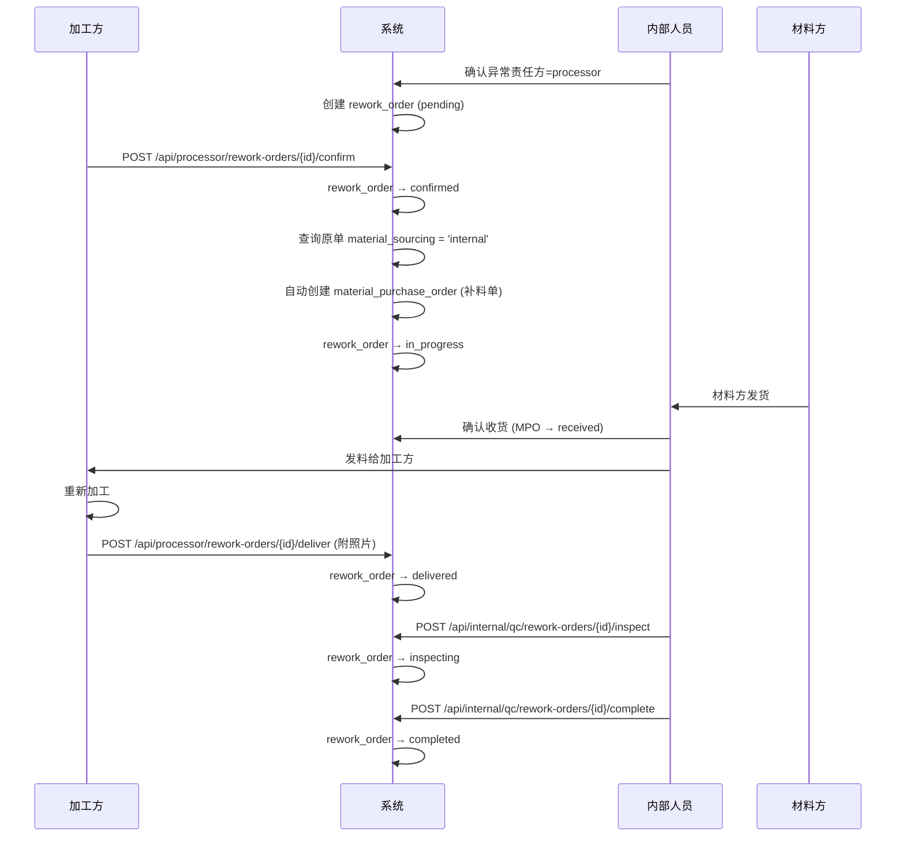
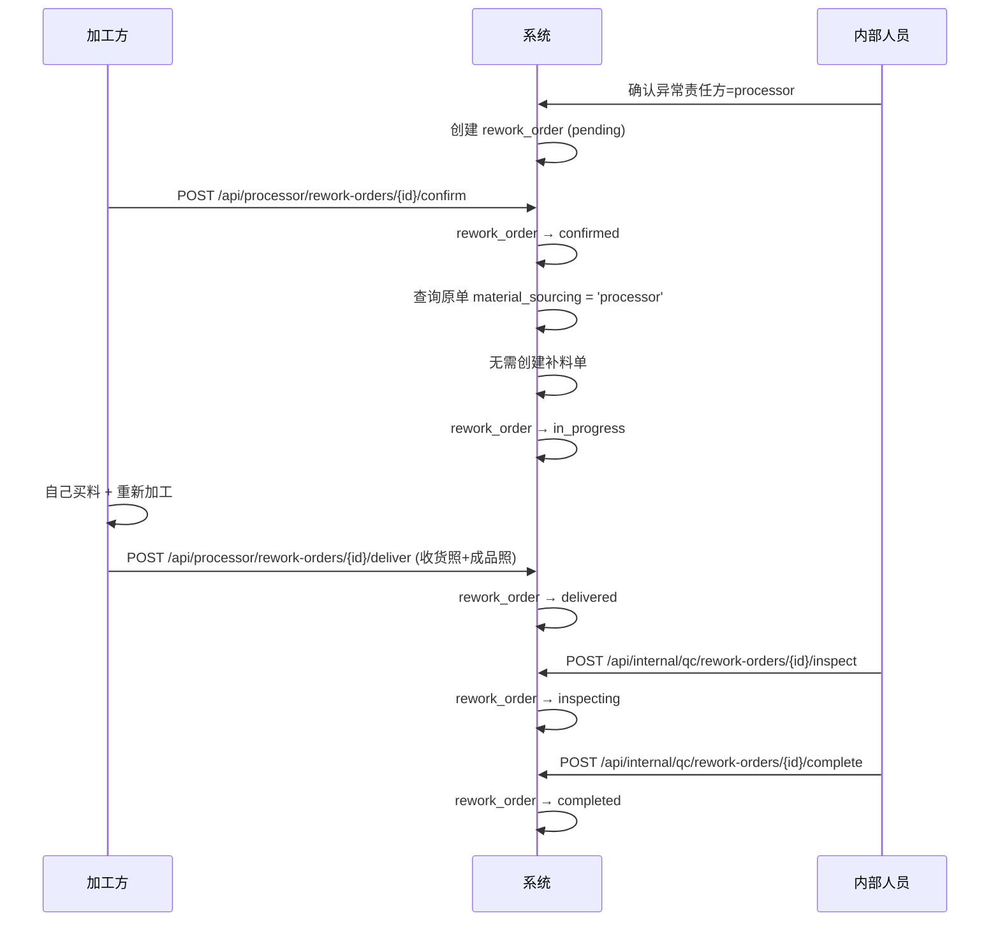

# Design Document: Rework Flow Enhancement (返工流程增强)

## Overview

当质检异常确认为加工方责任后，系统自动生成 `rework_orders`。当前加工方只能被动查看异常通知，无法交互。本设计增强返工流程：加工方可确认返工、上传交货照片、推进状态；系统根据原单的 `material_sourcing` 模式自动分支处理（我方补料 vs 加工方自采）；并增加费用追踪字段。

核心变更：
1. 加工方新增"确认返工"和"标记交货"交互能力
2. 返工单状态机扩展为 6 态：`pending → confirmed → in_progress → delivered → inspecting → completed`
3. 确认后根据 `material_sourcing` 自动创建补料单（Branch A）或直接进入重工（Branch B）
4. 新增费用追踪字段（cost_bearer / cost_amount / cost_remark）

## Architecture



## Sequence Diagrams

### Branch A: material_sourcing = 'internal' (我方找材料方)



### Branch B: material_sourcing = 'processor' (加工方自采)



## Components and Interfaces

### Component 1: Processor Rework API (加工方返工接口)

**Purpose**: 加工方确认返工、上传交货照片、查看返工单状态

**Interface**:
```python
# backend/mvp/routes/processor.py 新增

@router.get("/rework-orders")
async def list_rework_orders(user) -> dict:
    """加工方查看自己的返工单列表"""
    ...

@router.get("/rework-orders/{rework_id}")
async def get_rework_order(rework_id: int, user) -> dict:
    """加工方查看返工单详情（含原单信息、material_sourcing 模式）"""
    ...

@router.post("/rework-orders/{rework_id}/confirm")
async def confirm_rework(rework_id: int, payload: ReworkConfirm, user) -> dict:
    """加工方确认返工（pending → confirmed → in_progress）"""
    ...

@router.post("/rework-orders/{rework_id}/deliver")
async def deliver_rework(rework_id: int, payload: ReworkDeliver, user) -> dict:
    """加工方标记交货（in_progress → delivered），需上传照片"""
    ...

@router.post("/rework-orders/{rework_id}/photos")
async def upload_rework_photo(rework_id: int, stage: str, file: UploadFile, user) -> dict:
    """上传返工照片（receive/complete），复用 outsource_orders 照片模式"""
    ...
```

**Responsibilities**:
- 校验返工单归属（通过 original_order_id → outsource_orders.tenant_id）
- 状态转换合法性校验
- 确认时触发分支逻辑（自动创建补料单）
- 交货时校验照片已上传

### Component 2: Internal Rework Management API (内部返工管理接口)

**Purpose**: 内部人员推进返工流程、触发质检、关闭返工单

**Interface**:
```python
# backend/mvp/routes/qc.py 修改/新增

@router.post("/rework-orders/{rework_id}/inspect")
async def start_rework_inspection(rework_id: int, user) -> dict:
    """触发返工质检（delivered → inspecting）"""
    ...

@router.post("/rework-orders/{rework_id}/complete")
async def complete_rework(rework_id: int, user) -> dict:
    """返工质检通过（inspecting → completed）"""
    ...

@router.post("/rework-orders/{rework_id}/receive-material")
async def receive_rework_material(rework_id: int, user) -> dict:
    """确认补料已收货（Branch A 专用，更新关联 MPO 状态）"""
    ...
```

**Responsibilities**:
- 推进返工单后半段状态
- 关联质检记录
- Branch A 补料收货确认

### Component 3: Rework Auto-Branching Service (返工自动分支服务)

**Purpose**: 加工方确认后，根据 material_sourcing 自动执行分支逻辑

**Interface**:
```python
# backend/mvp/rework_service.py 新增

def process_rework_confirmation(rework_order_id: int, conn) -> dict:
    """
    确认后自动分支处理：
    1. 查询 original_order_id → outsource_orders.material_sourcing
       (fallback: outsource_orders.request_id → outsource_requests.material_sourcing)
    2. Branch A (internal): 自动创建 material_purchase_order
    3. Branch B (processor): 直接标记 in_progress
    返回: { branch: 'A'|'B', new_po_id: int|None }
    """
    ...

def create_rework_material_po(rework_order, original_order, conn) -> int:
    """
    为 Branch A 创建补料采购单：
    - 复制原 MPO 的 material_code, spec, qty, supplier_id
    - 标记 remark = '异常返工补料 - RW-xxx'
    - 关联 rework_orders.new_po_id
    返回: new material_purchase_order.id
    """
    ...
```

## Data Models

### ALTER TABLE: rework_orders (新增字段)

```sql
-- Migration 014: 返工流程增强
ALTER TABLE rework_orders
    ADD COLUMN IF NOT EXISTS confirmed_at       TIMESTAMP,
    ADD COLUMN IF NOT EXISTS confirmed_by       INTEGER REFERENCES users(id),
    ADD COLUMN IF NOT EXISTS confirm_remark     TEXT,
    ADD COLUMN IF NOT EXISTS delivered_at       TIMESTAMP,
    ADD COLUMN IF NOT EXISTS deliver_photos     JSONB DEFAULT '[]',
    ADD COLUMN IF NOT EXISTS deliver_remark     TEXT,
    ADD COLUMN IF NOT EXISTS inspected_at       TIMESTAMP,
    ADD COLUMN IF NOT EXISTS completed_at       TIMESTAMP,
    ADD COLUMN IF NOT EXISTS material_sourcing_mode VARCHAR(16),
    ADD COLUMN IF NOT EXISTS cost_bearer        VARCHAR(32) DEFAULT 'processor',
    ADD COLUMN IF NOT EXISTS cost_amount        DECIMAL(14,2),
    ADD COLUMN IF NOT EXISTS cost_remark        TEXT;

COMMENT ON COLUMN rework_orders.confirmed_at IS '加工方确认时间';
COMMENT ON COLUMN rework_orders.confirmed_by IS '加工方确认人 user_id';
COMMENT ON COLUMN rework_orders.confirm_remark IS '加工方确认备注';
COMMENT ON COLUMN rework_orders.delivered_at IS '加工方交货时间';
COMMENT ON COLUMN rework_orders.deliver_photos IS '交货照片路径数组 (收货照+成品照)';
COMMENT ON COLUMN rework_orders.deliver_remark IS '交货备注';
COMMENT ON COLUMN rework_orders.inspected_at IS '质检开始时间';
COMMENT ON COLUMN rework_orders.completed_at IS '返工完成时间';
COMMENT ON COLUMN rework_orders.material_sourcing_mode IS '材料供应模式快照: internal/processor';
COMMENT ON COLUMN rework_orders.cost_bearer IS '费用承担方: processor/internal/shared';
COMMENT ON COLUMN rework_orders.cost_amount IS '费用金额';
COMMENT ON COLUMN rework_orders.cost_remark IS '费用备注';
```

### Status Flow (状态机)

```
pending → confirmed → in_progress → delivered → inspecting → completed
                                                              ↘ cancelled (任意阶段可取消)
```

| Status | 含义 | 触发者 |
|--------|------|--------|
| pending | 等待加工方确认 | 系统自动（异常确认时） |
| confirmed | 加工方已确认返工 | 加工方 |
| in_progress | 补料中/加工方重工中 | 系统自动（确认后） |
| delivered | 加工方已交货 | 加工方 |
| inspecting | 质检中 | 内部人员 |
| completed | 返工完成 | 内部人员 |
| cancelled | 已取消 | 内部人员 |

### Valid Status Transitions

```python
REWORK_TRANSITIONS = {
    "pending":     {"confirmed", "cancelled"},
    "confirmed":   {"in_progress", "cancelled"},
    "in_progress": {"delivered", "cancelled"},
    "delivered":   {"inspecting", "cancelled"},
    "inspecting":  {"completed", "cancelled"},
    "completed":   set(),
    "cancelled":   set(),
}
```

## Key Functions with Formal Specifications

### Function: confirm_rework_order()

```python
async def confirm_rework(rework_id: int, payload: ReworkConfirm, user: CurrentUser) -> dict:
    """加工方确认返工单"""
```

**Preconditions:**
- `rework_id` 对应的 rework_order 存在
- rework_order.status == 'pending'
- user.tenant_id == 原 outsource_order.tenant_id（即加工方本人）
- user.tenant_type == 'processor'

**Postconditions:**
- rework_order.status 变为 'confirmed'
- rework_order.confirmed_at = now()
- rework_order.confirmed_by = user.user_id
- rework_order.confirm_remark = payload.remark
- 自动调用 process_rework_confirmation() 执行分支逻辑
- 分支完成后 status 变为 'in_progress'
- Branch A: 新建 material_purchase_order，rework_order.new_po_id 被填充
- Branch B: 无额外操作

### Function: deliver_rework_order()

```python
async def deliver_rework(rework_id: int, payload: ReworkDeliver, user: CurrentUser) -> dict:
    """加工方标记返工交货"""
```

**Preconditions:**
- rework_order.status == 'in_progress'
- user.tenant_id == 原 outsource_order.tenant_id
- deliver_photos 至少有 1 张照片已上传

**Postconditions:**
- rework_order.status 变为 'delivered'
- rework_order.delivered_at = now()
- rework_order.deliver_remark = payload.remark

### Function: process_rework_confirmation()

```python
def process_rework_confirmation(rework_order_id: int, conn) -> dict:
    """确认后自动分支处理"""
```

**Preconditions:**
- rework_order 存在且 status == 'confirmed'
- original_order_id 不为 NULL（加工方返工必有原单）

**Postconditions:**
- 查询 material_sourcing 来源：
  - 优先从 outsource_orders.material_sourcing
  - 回退到 outsource_requests.material_sourcing（通过 outsource_orders.request_id）
- rework_order.material_sourcing_mode 被填充
- rework_order.cost_bearer = 'processor'
- Branch A (internal): 创建新 MPO，rework_order.new_po_id = new_mpo.id
- Branch B (processor): 无额外操作
- rework_order.status → 'in_progress'

## Algorithmic Pseudocode

### Rework Confirmation Algorithm

```pascal
ALGORITHM confirmRework(rework_id, user, remark)
INPUT: rework_id (integer), user (CurrentUser), remark (string|null)
OUTPUT: result dict with branch info

BEGIN
  -- 1. 查询返工单 + 原单
  rework ← DB.fetch("SELECT * FROM rework_orders WHERE id = rework_id")
  ASSERT rework IS NOT NULL
  ASSERT rework.status = 'pending'
  
  original_order ← DB.fetch("SELECT * FROM outsource_orders WHERE id = rework.original_order_id")
  ASSERT original_order.tenant_id = user.tenant_id
  
  -- 2. 更新确认状态
  DB.update(rework_orders, SET status='confirmed', confirmed_at=NOW(),
            confirmed_by=user.user_id, confirm_remark=remark)
  
  -- 3. 确定 material_sourcing 模式
  sourcing ← original_order.material_sourcing
  IF sourcing IS NULL THEN
    request ← DB.fetch("SELECT material_sourcing FROM outsource_requests WHERE id = original_order.request_id")
    sourcing ← request.material_sourcing
  END IF
  
  DB.update(rework_orders, SET material_sourcing_mode=sourcing, cost_bearer='processor')
  
  -- 4. 分支处理
  new_po_id ← NULL
  IF sourcing = 'internal' THEN
    -- Branch A: 自动创建补料单
    new_po_id ← createReworkMaterialPO(rework, original_order)
    DB.update(rework_orders, SET new_po_id=new_po_id)
  END IF
  -- Branch B (processor): 无需额外操作
  
  -- 5. 推进到 in_progress
  DB.update(rework_orders, SET status='in_progress')
  
  RETURN {branch: IF sourcing='internal' THEN 'A' ELSE 'B', new_po_id: new_po_id}
END
```

### Auto-Create Material PO Algorithm (Branch A)

```pascal
ALGORITHM createReworkMaterialPO(rework, original_order)
INPUT: rework (rework_order record), original_order (outsource_order record)
OUTPUT: new_po_id (integer)

BEGIN
  -- 查找原始 MPO（通过 rework.original_po_id 或项目关联）
  IF rework.original_po_id IS NOT NULL THEN
    original_mpo ← DB.fetch("SELECT * FROM material_purchase_orders WHERE id = rework.original_po_id")
  ELSE
    -- 回退：找同项目同材料的最近 MPO
    original_mpo ← DB.fetch("SELECT * FROM material_purchase_orders 
                              WHERE project_id = rework.project_id 
                              ORDER BY created_at DESC LIMIT 1")
  END IF
  
  -- 生成新 PO 编号
  po_no ← "MP-RW-" + rework.rework_no.suffix + "-" + random_hex(4)
  
  -- 创建补料采购单
  new_po_id ← DB.insert(material_purchase_orders, {
    po_no: po_no,
    project_id: rework.project_id,
    supplier_id: original_mpo.supplier_id,
    tenant_id: original_mpo.tenant_id,
    material_code: original_mpo.material_code,
    spec: original_mpo.spec,
    qty: rework.qty OR original_mpo.qty,
    unit: original_mpo.unit,
    unit_price: original_mpo.unit_price,
    status: 'drafted',
    remark: '异常返工补料 - ' + rework.rework_no,
    created_by: SYSTEM_USER
  })
  
  RETURN new_po_id
END
```

## Example Usage

### 加工方确认返工

```python
# POST /api/processor/rework-orders/42/confirm
# Body: {"remark": "确认是我方加工问题，同意返工"}
# Response:
{
    "rework_id": 42,
    "status": "in_progress",
    "branch": "A",
    "material_sourcing_mode": "internal",
    "new_po_id": 156,
    "message": "已确认返工，系统已自动创建补料单 MP-RW-0013-A3F2"
}
```

### 加工方交货

```python
# POST /api/processor/rework-orders/42/deliver
# Body: {"remark": "已重新加工完成，请验收"}
# Precondition: 至少上传了 1 张照片
# Response:
{
    "rework_id": 42,
    "status": "delivered",
    "delivered_at": "2024-01-15T10:30:00Z"
}
```

### 内部触发质检

```python
# POST /api/internal/qc/rework-orders/42/inspect
# Response:
{
    "rework_id": 42,
    "status": "inspecting",
    "inspected_at": "2024-01-16T09:00:00Z"
}
```

## Error Handling

### Error Scenario 1: 加工方确认时状态不合法

**Condition**: rework_order.status != 'pending'
**Response**: HTTP 409 `{"detail": "返工单当前状态 'xxx' 不允许确认，需为 pending"}`
**Recovery**: 无需恢复，前端刷新状态

### Error Scenario 2: 加工方交货时未上传照片

**Condition**: deliver_photos 为空
**Response**: HTTP 400 `{"detail": "交货前必须上传至少 1 张照片"}`
**Recovery**: 加工方先调用 upload photo 接口

### Error Scenario 3: Branch A 找不到原始 MPO

**Condition**: original_po_id 为 NULL 且项目下无 MPO 记录
**Response**: 不自动创建 MPO，标记 rework_order 需人工处理
**Recovery**: 内部人员手动创建补料单并关联

### Error Scenario 4: 权限校验失败

**Condition**: user.tenant_id != outsource_order.tenant_id
**Response**: HTTP 403 `{"detail": "无权操作此返工单"}`
**Recovery**: N/A

## Testing Strategy

### Unit Testing Approach

- 状态机转换合法性测试（所有合法/非法转换组合）
- Branch A/B 分支逻辑测试（mock material_sourcing 值）
- 权限校验测试（正确/错误 tenant_id）
- 照片上传校验测试

### Integration Testing Approach

- 完整 Branch A 流程：异常确认 → 加工方确认 → 补料单创建 → 交货 → 质检 → 完成
- 完整 Branch B 流程：异常确认 → 加工方确认 → 交货 → 质检 → 完成
- 并发场景：多次确认同一返工单

## API Endpoint Summary

### 新增 Processor 端点 (backend/mvp/routes/processor.py)

| Method | Path | Description |
|--------|------|-------------|
| GET | /api/processor/rework-orders | 加工方返工单列表 |
| GET | /api/processor/rework-orders/{id} | 返工单详情 |
| POST | /api/processor/rework-orders/{id}/confirm | 确认返工 |
| POST | /api/processor/rework-orders/{id}/deliver | 标记交货 |
| POST | /api/processor/rework-orders/{id}/photos | 上传返工照片 |
| DELETE | /api/processor/rework-orders/{id}/photos | 删除返工照片 |

### 新增/修改 Internal 端点 (backend/mvp/routes/qc.py)

| Method | Path | Description |
|--------|------|-------------|
| POST | /api/internal/qc/rework-orders/{id}/inspect | 触发返工质检 |
| POST | /api/internal/qc/rework-orders/{id}/complete | 返工质检通过 |
| POST | /api/internal/qc/rework-orders/{id}/receive-material | 确认补料收货 (Branch A) |
| PATCH | /api/internal/qc/rework-orders/{id}/status | 修改为支持新状态 |

### Pydantic Models

```python
class ReworkConfirm(BaseModel):
    remark: Optional[str] = None

class ReworkDeliver(BaseModel):
    remark: Optional[str] = None

class ReworkCostUpdate(BaseModel):
    cost_amount: float = Field(..., ge=0)
    cost_remark: Optional[str] = None
```

## Frontend Changes

### 修改: backend/static/processor/my-exceptions.html

1. 在返工单列表中增加操作按钮列
2. `status='pending'` 时显示 "确认返工" 按钮
3. `status='in_progress'` 时显示 "标记交货" 按钮
4. 点击按钮弹出确认对话框（含备注输入框）
5. 交货前需先上传照片（复用 outsource_orders 照片上传 UI 模式）

### 新增: backend/static/processor/rework-detail.html

1. 返工单详情页（展示原单信息、material_sourcing 模式、状态时间线）
2. 照片上传区域（收货照 + 成品照）
3. 操作按钮区域（根据当前状态动态显示）
4. 费用信息展示区

### 修改: 内部管理页面

1. 返工单列表增加新状态筛选
2. 返工单详情增加"触发质检"和"完成"按钮
3. Branch A 补料单关联展示

## Security Considerations

- 加工方只能操作归属自己的返工单（通过 original_order_id → outsource_orders.tenant_id 校验）
- 状态转换严格按状态机执行，防止跳跃
- 照片上传复用现有文件安全策略（大小限制、类型白名单）
- 费用字段仅内部人员可修改

## Dependencies

- 现有 `outsource_orders` 照片上传模式（复用 upload pattern）
- 现有 `material_purchase_orders` 创建模式（复用 MPO 创建逻辑）
- 现有 `rework_orders` 表结构（ALTER TABLE 扩展）
- 现有 processor 认证中间件 `require_tenant_type("processor")`

## Correctness Properties

*A property is a characteristic or behavior that should hold true across all valid executions of a system—essentially, a formal statement about what the system should do. Properties serve as the bridge between human-readable specifications and machine-verifiable correctness guarantees.*

### Property 1: State machine enforces valid transitions only

*For any* rework order in status S and any attempted transition to status T, the transition SHALL succeed if and only if T is in the set of valid successors for S (pending→confirmed, confirmed→in_progress, in_progress→delivered, delivered→inspecting, inspecting→completed, and any non-terminal→cancelled). All invalid transitions SHALL be rejected with HTTP 409.

**Validates: Requirements 1.4, 4.5, 5.3, 5.4, 9.1, 9.2, 9.3**

### Property 2: State transitions record timestamps

*For any* successful state transition on a rework order, the corresponding timestamp field (confirmed_at, delivered_at, inspected_at, completed_at) SHALL be populated with a non-null value equal to or after the previous transition's timestamp.

**Validates: Requirements 1.2, 9.4**

### Property 3: Branch A confirmation creates a valid MPO copy

*For any* rework order whose original outsource order has material_sourcing = 'internal', confirming the rework order SHALL produce a new Material_Purchase_Order where material_code, spec, qty, supplier_id, and unit match the original MPO, the remark references the rework order number, the rework order's new_po_id points to the new MPO, material_sourcing_mode = 'internal', and the final status is 'in_progress'.

**Validates: Requirements 2.1, 2.2, 2.3, 2.4, 2.5**

### Property 4: Branch B confirmation creates no MPO

*For any* rework order whose original outsource order has material_sourcing = 'processor', confirming the rework order SHALL result in status 'in_progress', material_sourcing_mode = 'processor', new_po_id = NULL, and no new Material_Purchase_Order created.

**Validates: Requirements 3.1, 3.2, 3.3**

### Property 5: Delivery requires at least one photo

*For any* rework order in 'in_progress' status, a delivery attempt SHALL succeed only if deliver_photos contains at least 1 entry. Attempts with zero photos SHALL be rejected with HTTP 400.

**Validates: Requirements 4.4**

### Property 6: Tenant isolation on rework operations

*For any* rework order and any user whose tenant_id does not match the original outsource order's tenant_id, all processor-side operations (confirm, deliver, upload photos) SHALL be rejected with HTTP 403. Cost field modifications SHALL be rejected for non-internal users.

**Validates: Requirements 1.5, 6.4**

### Property 7: Material supplier fault + processor sourcing overrides to processor

*For any* exception confirmed with responsible_party = 'material_supplier' AND material_sourcing = 'processor', the system SHALL override responsible_party to 'processor', create a rework_order targeting the processor, set resolution_path to 'rework_process', and record the original 'material_supplier' determination in the responsibility record.

**Validates: Requirements 8.1, 8.2, 8.3, 8.4**

### Property 8: Material supplier fault + internal sourcing creates redelivery (no processor rework)

*For any* exception confirmed with responsible_party = 'material_supplier' AND material_sourcing = 'internal', the system SHALL create a Material_Redelivery_Request referencing the original MPO and exception, and SHALL NOT create a rework_order targeting the processor.

**Validates: Requirements 7.1, 7.2, 7.4**

### Property 9: Redelivery completion resolves exception

*For any* Material_Redelivery_Request that is marked as received by an internal user, the associated quality exception status SHALL transition to 'resolved'.

**Validates: Requirements 7.3**

### Property 10: Cost bearer defaults to processor

*For any* rework order created where the responsible_party is 'processor', the cost_bearer field SHALL default to 'processor'.

**Validates: Requirements 6.2**
